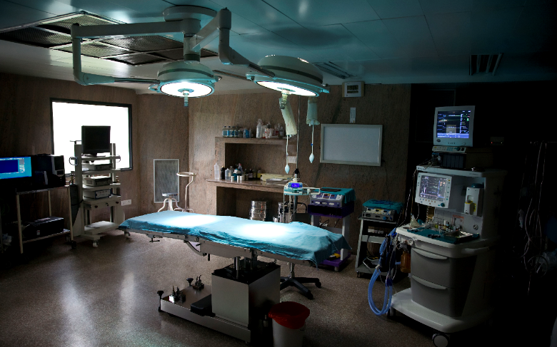

# Analysis of Variability in Hospital Charges Across the United States

Group Project by Bill White, Bosco Sitati, Ji-Heon Kim, Leishla Perez

## Summary

The overall aim of this project was to determine if there exists a correlation between the amounts charged by a hospital for a procedure and the median income of the regional area in which the hospital is located. To determine this, we asked and answered the following questions:

1) What does the median income per zip code distribution across the US look like?

2) What are the most common procedures performed by hospitals across the US between 2011 and 2017 and which 5 of these should we choose to analyze?

3) What does the variability of the costs of the 5 procedures chosen look like across the US?

4) Is the average of any given year’s hospital charges significantly different from the average hospital charges across all years?

5) Is there a correlation between average hospital charges for procedures and regional median income?

## Data Cleanup and Exploration

### 1. Imported each year's hospital billed services data files

Raw data from Centers For Medicare And Medicaid Services (CMS)

Data Source:
cms.gov/Research-Statistics-Data-and-Systems/Statistics-Trends-and-Reports/Medicare-Provider-Charge-Data/

### 2. Cleaned up / reformatting of each year's hospital billed services data frame

Replace ">" with "+" in 2015, 2016 and 2017 dataframe values in DRG column 

Converted values in 'Total Discharges' and 'Average Covered Charges' columns to floats

Added year column to all individual year dataframes

### 3. Concated separate year data frames into one data frame (final_hospital_df)

Final data frame contained more than 1.2 million entries

### 4. Imported of each year's median income data files and convert to data frames

### 5. Concatted separate year median income data frames into a master final median income data frame

After cleaning up median income data. Created graphics and print to screen information to help visualize the data.

### 6. Merged Hospital data frame with Median Income data frame by year and zip code

Merged based on Zip code and Payment Year

Converted strings to floats in 'Provider Id' and 'Provider Zip Code' columns

## Analysis

### Step 1. Determed Most Performed Procedures by Year and Looked for Commonality Across Seven Years

Annual data analysis looked as follows (2011 example):

Created filtered dataframe with only the five procedures chosen:

470 - MAJOR JOINT REPLACEMENT OR REATTACHMENT OF LOWER EXTREMITY W/O MCC,
871 - SEPTICEMIA OR SEVERE SEPSIS W/O MV 96+ HOURS W MCC,
392 - ESOPHAGITIS, GASTROENT & MISC DIGEST DISORDERS W/O MCC,
690 - KIDNEY & URINARY TRACT INFECTIONS W/O MCC,
194 - SIMPLE PNEUMONIA & PLEURISY W CC

### Step 2. How variable are procedure costs across the US?

Created Histograms by Year to Number of Cases Based on Average Costs of Procedure in 2011

Object was to view distribution

Example of one histogram:

Created Boxplots to View Outliers for Procedure Costs - 2011-2017 Average Costs Per Procedure

Determined outliers should remain in the data set because the data set contained all occurences and because our objective was to determine if procedure costs were correlated to regional median income which required the inclusion of all data points.

Example of one boxplot:

### Step 3. Evaluated whether average of 2011 hospital charges significantly different from the average of the 2011-2017 hospital charges.

To determine if significant differences exist, utilized matplotlib to visualize data and Welch's t-test for p-value

### Step 4. Finally prepared to answer the question: Is there a correlation between hospital charges and regional median income?

Performed analysis by creating scatterplots and linear regressions of average procedure cost vs regional median income for each procedure accross all seven years.

Developed the following charts:

## Conclusion: Based on r-squared values below .05 and relatively flat linear regression lines, there does not appear to exist a correlation between the amounts charged by a hospital for a procedure and the median income of the regional area.

